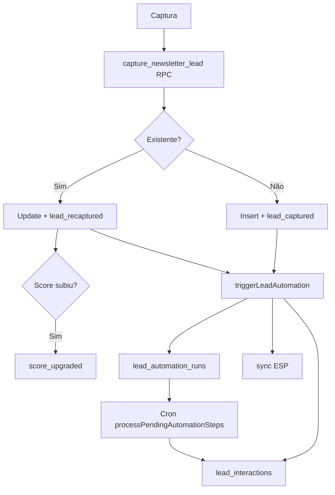

# Fase 5.3 — CRM e Automação Inteligente

Evolui a captura de leads (Fase 5.2) em um mini-CRM com pipeline visual, histórico de interações, sequências de nutrição persistidas e métricas de conversão por origem — preparado para Brevo, HubSpot e RD Station.

## Objetivo

- **Pipeline CRM** — colunas frio → muito quente
- **Dashboard de conversão** — `/admin/conversao`
- **Histórico de interações** — timeline por lead
- **Sequências automáticas** — runs persistidos + cron de steps com delay
- **Integração ESP** — Brevo (live opcional), HubSpot e RD Station (payloads prontos)
- **Métricas por origem** — total, quentes, taxa, 7/30 dias

## Escopo excluído (não alterado)

Score, Minha Saúde, Biblioteca (módulo), Marketplace, Assinaturas.

## Migration

| Arquivo | Descrição |
|---------|-----------|
| `028_crm_automation.sql` | CRM columns, `lead_interactions`, `lead_automation_runs`, RPC `capture_newsletter_lead` |

### Ordem de execução no Supabase

1. `023_newsletter_leads_interest.sql`
2. `027_lead_score_conversion.sql`
3. **`028_crm_automation.sql`**

### Novas tabelas

| Tabela | Uso |
|--------|-----|
| `lead_interactions` | Timeline — captura, upgrade de score, automação, sync ESP |
| `lead_automation_runs` | Execução de sequências de nutrição por lead |

### Colunas em `newsletter_leads`

| Coluna | Descrição |
|--------|-----------|
| `updated_at` | Última atualização do registro |
| `last_interaction_at` | Última interação CRM |
| `interaction_count` | Total de interações |
| `esp_provider` | brevo \| hubspot \| rdstation \| mailerlite |
| `esp_external_id` | ID no ESP |
| `esp_synced_at` | Data do sync bem-sucedido |
| `esp_sync_error` | Erro do último sync |

### RPC `capture_newsletter_lead`

Upsert por e-mail com upgrade automático de score (nunca rebaixa). Retorna `lead_id`, `is_existing`, `final_score`, `previous_score`.

## Arquitetura

```
src/lib/crm/
  types.ts              # Tipos CRM
  interactions.ts       # recordLeadInteraction, listLeadInteractions
  automation-runs.ts    # create/update/list runs, pending steps
  pipeline.ts           # Pipeline columns + métricas por origem
  esp-sync.ts           # Payloads Brevo/HubSpot/RD + updateLeadEspSync

src/lib/admin/services/
  conversion.service.ts # getConversionDashboard()
  leads.service.ts      # + getAdminLeadById, campos ESP

src/lib/email-automation/
  dispatcher.ts         # triggerLeadAutomation + processPendingAutomationSteps
  providers/index.ts    # Brevo live (opt-in), HubSpot/RD preparados

src/lib/supabase/
  service-role.ts       # Cliente service role (server-only)
```

## Admin

| Rota | Função |
|------|--------|
| `/admin/conversao` | Dashboard — pipeline, métricas por origem, interações recentes |
| `/admin/leads` | Lista + pipeline resumido + links para detalhe |
| `/admin/leads/[id]` | Detalhe — ESP, sequências, timeline |

Menu admin: item **Conversão** adicionado em `src/lib/admin/nav.ts`.

## Pipeline de leads

O pipeline usa `lead_score` como estágio:

| Estágio | Label |
|---------|-------|
| `frio` | Frio |
| `morno` | Morno |
| `quente` | Quente |
| `muito_quente` | Muito quente |

Re-capturas via `capture_newsletter_lead` incrementam `interaction_count` e podem elevar o score (`isHotterScore` em SQL).

## Sequências de nutrição

1. `saveLeadAction` → RPC → `triggerLeadAutomation`
2. Cria `lead_automation_runs` + interações (`sequence_started`, `sequence_step_sent`, …)
3. Steps com `delay` agendam `next_step_at`
4. Cron processa pendentes:

```bash
POST /api/cron/automation
Authorization: Bearer $LEAD_AUTOMATION_CRON_SECRET
```

Resposta: `{ ok, processed, completed }`.

## Integração ESP

### Variáveis

```env
SUPABASE_SERVICE_ROLE_KEY=     # Obrigatório para interações/automação persistidas
LEAD_ESP_PROVIDER=brevo        # Opcional: brevo | hubspot | rdstation | mailerlite
LEAD_ESP_LIVE_SYNC=true        # Ativa POST real no Brevo
BREVO_API_KEY=
HUBSPOT_API_KEY=
RDSTATION_API_KEY=
LEAD_AUTOMATION_CRON_SECRET=   # Cron de steps com delay
```

### Comportamento

| Provedor | Status |
|----------|--------|
| **Brevo** | Payload + sync live com `LEAD_ESP_LIVE_SYNC=true` |
| **HubSpot** | Payload CRM v3 preparado — sync live pendente |
| **RD Station** | Payload conversion API preparado — sync live pendente |

Sync atualiza `newsletter_leads.esp_*` e registra interação `esp_synced` / `esp_sync_failed`.

## Métricas de conversão por origem

Calculadas em `buildSourceConversionMetrics()`:

- Total de leads por `source`
- Contagem quente (`quente` + `muito_quente`)
- Taxa quente (%)
- Capturas nos últimos 7 e 30 dias

Exibidas em `/admin/conversao` e exportáveis via CSV em `/admin/leads`.

## Fluxo CRM



## Build

```bash
npm run build
```

## Próximos passos (fora do escopo)

1. Sync live HubSpot CRM v3 e RD Station Conversion API
2. Templates HTML por `templateKey`
3. Kanban drag-and-drop manual de estágio
4. Webhooks ESP (opens/clicks) → `lead_interactions`
5. Unificar `newsletter_subscribers` com `newsletter_leads`
